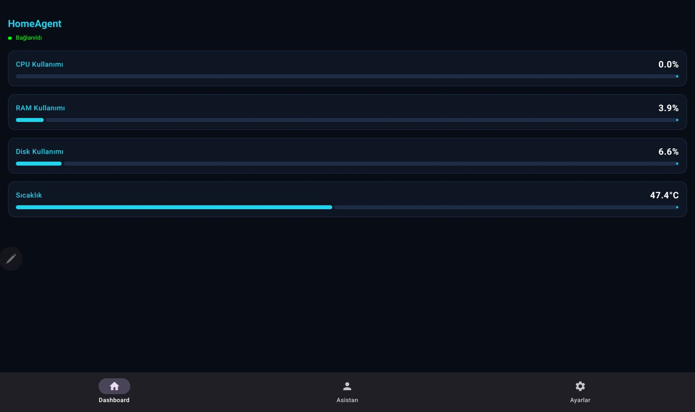

# 📱 HomeAgentMobileK (Android & Tablet)

HomeAgentMobileK is the powerful, multi-tabbed main mobile management interface of the AI-powered HomeAgent system, designed for Android smartphones and tablets.

## 📸 Screenshots

## 🌟 System Features
- **Modern Jetpack Compose Infrastructure:** A 100% declarative and responsive visual interface strictly conforming to the latest Material 3 (M3) design patterns.
- **Clickable Bottom Navigation:** Seamless and instant animated transitions between Dashboard, AI Assistant, and Settings tabs using a modular `NavHost`.
- **Pull-To-Refresh:** Instantly test connections and refresh data via a simple "Pull Down" gesture on the screen when the connection with the server (Raspberry Pi, etc.) weakens or drops.
- **System Statistics:** Real-time displays of processor, memory, disk, and heat ratios of connected devices inside elegant `MetricCard` interfaces.
- **AI Module (Gemini):** Functioning just like a voice assistant; send voice instructions/queries to Google Gemini AI by pressing a giant microphone button. The device instantly responds with both written text and **Turkish (tr-TR) Text-To-Speech (TTS)** voice output!

## 🧩 Software Architecture
- **MVVM Pattern:** Strict separation of business logic from UI using `ViewModel` and `StateFlow`.
- **Networking:** Synchronous API architecture based on `Retrofit` and `GsonConverter`.
- **Cryptography:** Secure, encrypted local preference storage using `androidx.security.crypto.EncryptedSharedPreferences`.

## 🛠 Usage
After cloning the project via Android Studio, make sure your device and your HomeAgent (Backend) device are on the same network or share a static IP. If necessary, you can revise the IP routing within `DashboardViewModel.kt` according to your specific target.

## 🔗 Ecosystem
This application is the grand visual showcase of the system. For the other parts of the ecosystem:
- **HomeAgent:** The Python FastAPI brain (Backend) serving data for the system.
- **AgentJee:** The lightweight interface optimized for Wear OS Smartwatches.
